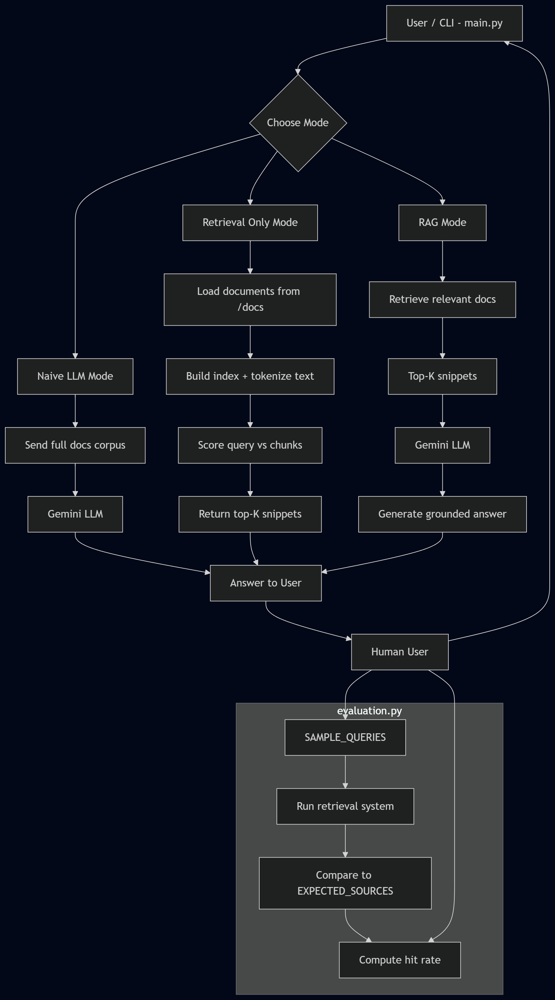

## Final Summary

The core concept students needed to understand in the earlier modules (1–3) is how simple retrieval systems can be used to ground AI responses in real documentation before introducing more advanced language model generation.

I believe students will most commonly struggle with the first step of the setup as it was a bit confusing to get done at first with --bare and --mirror.

AI tools were helpful for generating code scaffolding and suggesting implementation ideas, but they were often misleading when they introduced overly complex retrieval methods or ignored the simplicity required in early module designs.

One effective way to guide students without giving away the solution was to have them trace a query through the system step-by-step to identify where relevant information was lost, while also analyzing the system architecture to understand how each component contributes to the final output.

## Reliability and Evaluation

How reliability is measured:

Hit Rate = correct retrievals / total queries

The system includes basic logging points that allow debugging of:

- Which documents were retrieved
- How chunks were scored
- When no relevant documents were found

# DocuBot – AI Documentation Assistant (RAG System)

## 1. Original Project (Modules 1–3)

This project is an extension of my earlier AI system built in Modules 1–3. The original version focused on building a simple documentation assistant that could load text files and return relevant information using keyword-based retrieval.

The goal of the original system was to explore basic information retrieval techniques and understand how structured text search can improve AI-assisted question answering. It did not include any large language model integration or evaluation framework at the beginning.

---

## 2. Title and Summary

### Title:
**DocuBot – Retrieval-Augmented Documentation Assistant**

### Summary:
DocuBot is an AI-powered assistant that helps developers answer questions about a codebase by combining document retrieval with large language model generation. It uses a Retrieval-Augmented Generation (RAG) pipeline to ensure answers are grounded in actual documentation.

This project matters because it demonstrates how modern AI systems combine search and generation to produce accurate and explainable responses.

---

## 3. Architecture Overview

DocuBot is built using three main components:

- **Retrieval System:**  
  Loads documentation files, tokenizes text, builds a simple inverted index, and retrieves relevant text chunks based on query similarity.

- **LLM Layer:**  
  Uses Google Gemini to generate natural language responses. It is used in both naive mode and RAG mode.

- **Evaluation System:**  
  Measures retrieval performance using predefined sample queries and expected document matches.

  